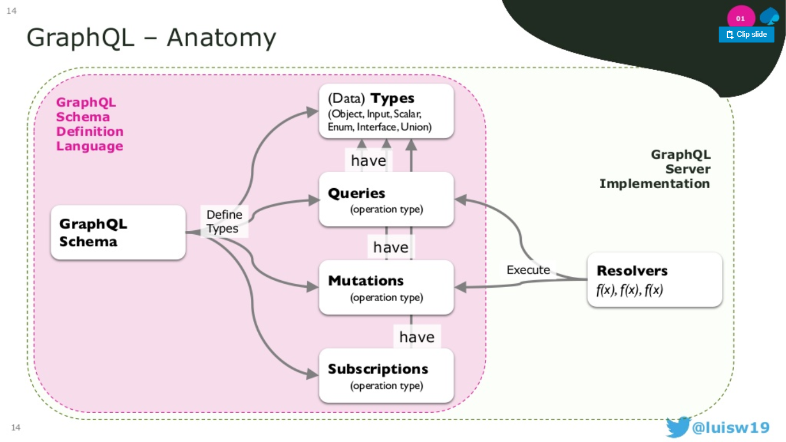

# GraphQL

1. Overview 

2. **Federation** [How Expedia Group replaced their BFF with a data graph and eliminated technical debt](https://blog.apollographql.com/what-i-learned-at-graphql-summit-f61d6fc6680a)

3. [Data Source Pattern used by Zillow Group on Trulia.com](https://blog.apollographql.com/what-i-learned-at-graphql-summit-f61d6fc6680a)

